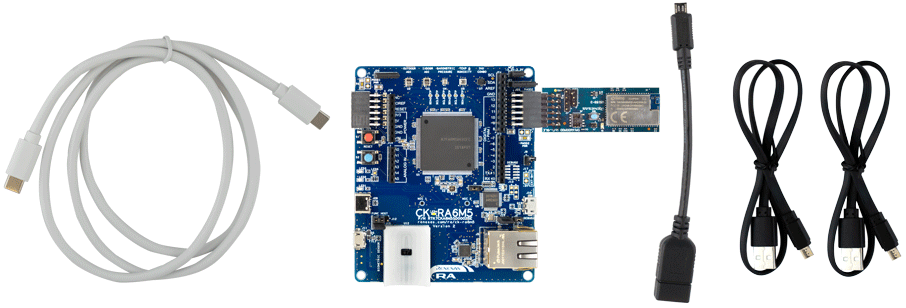
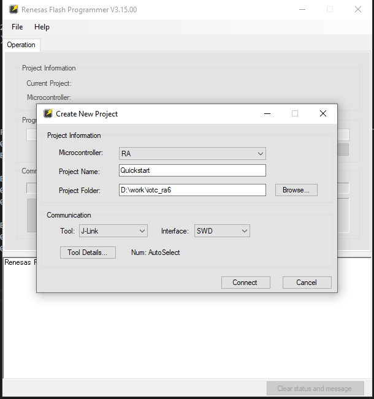
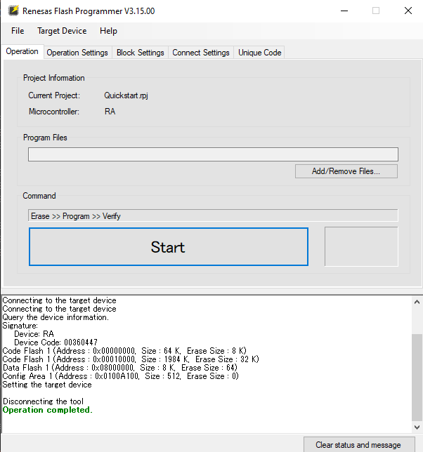
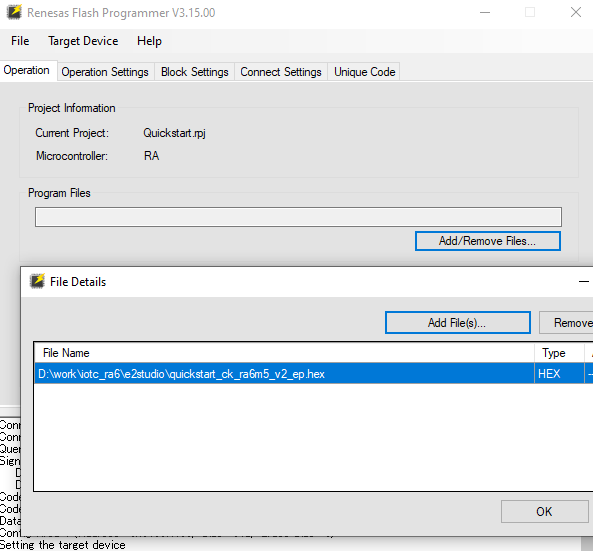
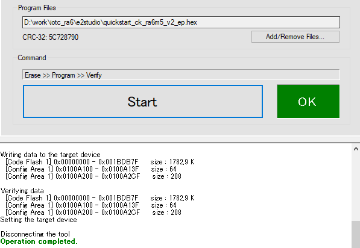

# QuickStart: Renesas Cloud Kit CK-RA6M5 with /IOTCONNECT
[Purchase the CK-RA6M5 Cloud Kit](https://www.newark.com/renesas/rtk7cka6m5s04001be/cloud-kit-32bit-arm-cortex-m33f/dp/33AK7066)

## 1. Introduction
This guide will walk through the steps of setting up the CK-RA6M5 for connecting to the Avnet /IOTCONNECT platform and interacting with the onboard sensors in realtime via a Dynamic Dashboard.
This project is based on the [Renesas CK-RA6M5 Sample Code](https://www.renesas.com/us/en/products/microcontrollers-microprocessors/ra-cortex-m-mcus/ck-ra6m5-cloud-kit-based-ra6m5-mcu-group#documents) and the [/IOTCONNECT AT Command-enabled PMOD module](https://github.com/avnet-iotconnect/iotc-dialog-da16k-sdk) for connectivity. 

## 2. Prerequisites
* [Renesas CK-RA6M5 v2 Cloud Kit](https://www.newark.com/renesas/rtk7cka6m5s04001be/cloud-kit-32bit-arm-cortex-m33f/dp/33AK7066)
* [FTDI USB Cable](https://www.amazon.com/DSD-TECH-SH-U09G-Serial-FT232RL/dp/B083HVM7VZ/)
* PC with Windows 11
* Available 2.4GHz WiFi Network
* A Serial Terminal Application such as [Tera Term](https://teratermproject.github.io/index-en.html)
* [Renesas Flash Programmer for Windows](https://www.renesas.com/us/en/software-tool/renesas-flash-programmer-programming-gui#downloads)

## 3. Create /IOTCONNECT Account
An /IOTCONNECT account with an AWS backend is required.  If you need to create an account, a free trial subscription is available.
The free subscription may be obtained directly from [iotconnect.io](https://iotconnect.io) or through the AWS Marketplace.

* Option #1 **(Recommended)**   
/IOTCONNECT via [AWS Marketplace](https://github.com/avnet-iotconnect/avnet-iotconnect.github.io/blob/main/documentation/iotconnect/subscription/iotconnect_aws_marketplace.md) - 60 day trial; AWS account creation required  

* Option #2  
/IOTCONNECT via [iotconnect.io](https://subscription.iotconnect.io/subscribe?cloud=aws) - 30 day trial; no credit card required

> [!NOTE]
> Be sure to check any SPAM folder for the temporary password after registering.

## 4. Import Device Template

1. Download the pre-made [Device Template](./template/da16k_template.JSON) for the Edge E84 AI Kit.
2. Login to the platform by navigating to [console.iotconnect.io](https://console.iotconnect.io)
3. From the navigation panel on the left, select the **Devices** icon and the **Device** sub-menu.   
4. At the bottom of the page, select the **Templates** icon from the toolbar.   
5. At the top-right of the page, select the **Create Template** button.   
6. At the top-right of the page, select the **Import" button**.   
7. Click the **Browse** button, navigate to and select the downloaded template `da16k_template.json`
8. Click **Save**

## 5. Create a Device
In this step, we will create a **Device** associated with the previously imported **Device Template**

1. In the ribbon at the bottom of the screen, click the **Devices**
2. At the top-right, click **Create Device**  

3. Enter a custom device **Unique ID** (also called a **DUID**) and **Device Name** such as `CK-RA6M5`
4. Select the **Entity** to associate the device (For new accounts, there is only one option)  
5. Select the previously imported template `da16k` 
6. Under **Device Certificate** select **Auto-generated**
7. Click **Save & View**
8. Download the **Device Configuration Information** by clicking the icon in the upper right of the device page  

## 6. Obtain Certificates
In this step we will locate and download the **device certificates**.

1. Just below the Device Configuration Information icon, click the `Connection Info` link. 
2. Click on the **Certificates** icon in the top-right and save the file to your working directory. 
3. Extract the contents of the `*-certificates.zip` file for use in the next section. 

> [!IMPORTANT]
> You will need the information contained within the 'Device Configuration Information' and the 'Certificates' files to complete the following step. 
## 7. Flash & Program the DA16600 PMOD

The DA16600 PMOD included with the kit is leveraged to connect to a WiFi network and communicate with the /IOTCONNECT platform. 

Follow the [DA16K AT Interface QuickStart Guide](https://github.com/avnet-iotconnect/iotc-dialog-da16k-sdk/blob/main/doc/QUICKSTART.md) and return to this guide when programmed. 

## 8. Setup Hardware

1. Remove the FTDI wires from the DA16600 PMOD
2. Connect the DA16600 PMOD to the **PMOD1** connector of CK-RA6M5
3. Connect the included USB-A to USB-micro cable from the PC to the connector labeled **DEBUG1** (next to the Ethernet port)
4. Reconnect power to the CK-RA6M5

## 9. Download and Flash the Pre-Compiled CK-RA6M5 Firmware

1. Download the pre-compiled firmware image: [quickstart_ck_ra6m5_v2_ep.hex](./e2studio/Debug/quickstart_ck_ra6m5_v2_ep.hex)
2. Download and Install the latest version of the [Renesas Flash Programmer for Windows](https://www.renesas.com/us/en/software-tool/renesas-flash-programmer-programming-gui#downloads)
3. Using `File` - `New Project`, create a new project.
4. Select `RA` as Microcontroller, `J-Link` as Tool, and `SWD` as Interface.
5. Press `Connect`.
5. Verify the connection is successful.
6. Select `Add/Remove Files...`, click `Add File(s)...`, navigate to and select the `.hex` file previously downloaded.
7. Click OK.
8. Press **Start** to start the flashing process and a progress window will pop up.
9. Verify `Operation Completed.` message is displayed after the progress bar reaches completes.

## 10. Check Connectivity 

Once the device is flashed, the device will boot, connect to /IOTCONNECT, and begin sending out telemetry.

* Find your device in the /IOTCONNECT "Devices" menu and verify telemetry is visible on the device's **Live Data** tab.

## 11. Import Dynamic Dashboard
/IOTCONNECT Dynamic Dashboards are an easy way to visualize data and interact with edge devices.  
1. Download the example **CK-RA6M5 Demo Dashboard** here: [CKRA6M5_dashboard.json](./template/CKRA6M5_dashboard.json)
2. Switch back to the /IOTCONNECT browser window and verify the device status is displaying as `Connected`
3. **Click** `Create Dashboard` from the top of the page
4. **Select** the `Import Dashboard` option and **Click** *Browse* to select the dashboard template previously downloaded.
5. **Select** the *Template* ("da16k") and your *Device Name*
6. **Enter** a name (such as `CK-RA6M5 Demo`) and **Click** *Save* the finalize the import

You will now be in the dashboard edit mode. You can add/remove widgets or just click `Save` in the upper-right corner to exit the edit mode.

## 12. Resources
* [Purchase Renesas Cloud Kit CK-RA6M5](https://www.newark.com/renesas/rtk7cka6m5s04001be/cloud-kit-32bit-arm-cortex-m33f/dp/33AK7066)
* /IOTCONNECT Resources