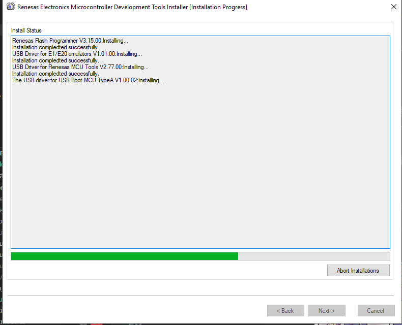

# CK-RA6M5 v2 PMOD /IOTCONNECT Quickstart

This quickstart guide will walk you through how to enable an Avnet /IOTCONNECT AT-Command Interface project example for 
the Renesas CK-RA6M5 v2.

This code is based on the [CK-RA6M5 v2 Sample Code](https://www.renesas.com/us/en/products/microcontrollers-microprocessors/ra-cortex-m-mcus/ck-ra6m5-cloud-kit-based-ra6m5-mcu-group#documents) project and uses an [/IOTCONNECT AT Command-enabled PMOD module (e.g. DA16K based)](https://github.com/avnet-iotconnect/iotc-dialog-da16k-sdk) 
as a gateway.

## Hardware Requirements

* [Renesas CK-RA6M5 v2 Cloud Kit](https://www.renesas.com/us/en/products/microcontrollers-microprocessors/ra-cortex-m-mcus/ck-ra6m5-cloud-kit-based-ra6m5-mcu-group)
* [DA16600 Wi-Fi-BLE combo module](https://www.renesas.com/en/products/da16600mod). 
or [DA16200 Wi-Fi-BLE combo module](https://www.renesas.com/en/products/da16200mod)
## Guide

### 1. Configure DA16x00 PMOD Module

This project is dependent upon the [iotc-freertos-da16k-atcmd-lib](https://github.com/avnet-iotconnect/iotc-freertos-da16k-atcmd-lib) 
project. A fully set up DA16600 PMOD Module is required to be configured and connected to /IOTCONNECT. 
Follow the [DA16K AT Interface Quick Start guide](https://github.com/avnet-iotconnect/iotc-dialog-da16k-sdk/blob/main/doc/QUICKSTART.md) 
to achieve this before proceeding to the next step of this guide.

**Ensure that the DA16x00 module is connected to the PMOD1 connector of CK-RA6M5 v2.**

### 2. Follow Manufacturer Setup Guide First

Follow the [Renesas CK-RA6M5 v2 Quick Start Guide](https://www.renesas.com/us/en/products/microcontrollers-microprocessors/ra-cortex-m-mcus/ck-ra6m5-cloud-kit-based-ra6m5-mcu-group#documents) 
to set up your CK-RA6M5 v2 board so it is ready for this project.


### 3. Download the Pre-Compiled CK-RA6M5 Firmware

Click [here](./e2studio/Debug/quickstart_ck_ra6m5_v2_ep.hex) to access and download the binary image firmware.

### 4. Flash the Firmware

Follow the appropriate set of instructions below depending on your host PC operating system.

#### Linux Host PC

1.) Download the latest Linux version of the [Renesas Flash Programmer](https://www.renesas.com/us/en/software-tool/renesas-flash-programmer-programming-gui#downloads) 

> [!NOTE]
> At the time of testing, the latest released version is **3.15**.

2.) Unpack the `RFP_CLI` archive downloaded from the Renesas Flash Programmer link above (e.g. `RFP_CLI_Linux_V31500_x64.tgz`).

```bash
tar -xvzf RFP_CLI_Linux_V31500_x64.tgz
```

> [!NOTE]
> The resulting folder should have the necessary `rfp-cli` program.

3.) Connect your board to the PC using the USB cable.

4.) To flash the image, `cd` into the extracted flash programmer folder and execute the `rfp-cli` tool with this command:

```bash
rfp-cli -device RA -tool jlink -if swd -a ~/Downloads/quickstart_ck_ra6m5_v2_ep.hex
```

Here is an example of the expected terminal output:

```
Renesas Flash Programmer CLI V1.09
Module Version: V3.15.00.000
Load: "/home/user/work/test/e2studio/Debug/quickstart_ck_ra6m5_v2_ep.hex" (Size=5135834, CRC=5C728790)

Connecting the tool (J-Link)
      J-Link Firmware: J-Link OB-RA4M2 compiled Oct 30 2023 12:13:20
Tool: J-Link (SEGGER J-Link (unknown))                                          
Interface: SWD

Connecting the target device
Speed: 1,500,000 Hz
Connected to RA

Erasing the target device
  [Code Flash 1]       00000000 - 001FFFFF
  [Data Flash 1]       08000000 - 08001FFF                                      
  [Code Flash 1]       00000000 - 001BFFFF                                      
Writing data to the target device                                               
  [Code Flash 1]       00000000 - 001BDB7F
  [Config Area 1]      0100A100 - 0100A13F                                      
  [Config Area 1]      0100A200 - 0100A2CF                                      
Verifying data on the target device                                             
  [Code Flash 1]       00000000 - 001BDB7F
  [Config Area 1]      0100A100 - 0100A13F                                      
  [Config Area 1]      0100A200 - 0100A2CF                                      
                                                                                

Disconnecting the tool

Operation successful
```

#### Windows

1.) Download the latest Windows version of the [Renesas Flash Programmer](https://www.renesas.com/us/en/software-tool/renesas-flash-programmer-programming-gui#downloads) 

> [!NOTE]
> At the time of testing, the latest released version is **3.15**.



2.) Using `File` - `New Project`, create a new project.

3.) Select `RA` as Microcontroller, `J-Link` as Tool, and `SWD` as Interface.


4.) Press `Connect`.

You should now have a successful connection.


5.) Next, select `Add/Remove Files...`, click `Add File(s)...`, navigate to the `e2studio` folder and select the `.hex` file.


6.) Click OK.

7.) Press **Start** to start the flashing process.

A progress window will pop up.

At the end an `Operation Completed.` message will remain in the status box.


### 5. Usage 

Once the device is flashed, the device will boot, connect to /IOTCONNECT, and start sending out telemetry.

If the DA16x00 device is connected to the correct PMOD port and is configured to connect to your /IOTCONNECT 
instance, the telemetry will be visible in /IOTCONNECT on your device's **Live Data** tab.

#### Supported /IOTCONNECT Device Commands

You can add these commands to your device template in the /IOTCONNECT Dashboard.

* `set_red_led <state>`

    Controls state of red LED on the board

    * `on` - Turns red LED on
    * `off` - Truns red LED off

* `set_led_frequency <freq>`

    Controls the frequency of the blue LED flashing on the board

    * `0` - Slow blinking
    * `1` - Medium blinking
    * `2` - Fast blinking
    * `3` - Very fast blinking

To execute the commands while your device is connected, go to your device's page in /IOTCONNECT and then click on the 
**Commands** tab of the vertical toolbar. On this page you can select a command that is supported by the template and 
enter parameters before sending.

### 6. Going Further: Building & Development

If you wish to modify this project or to build your own from scratch you can do so by installing and using the 
[Flexible Software Package with e² Studio IDE](https://www.renesas.com/us/en/software-tool/flexible-software-package-fsp).

You can open/import, build and debug the project as per the Renesas Quick Start guide.

> [!NOTE]
> The project is tested and built with FSP version 5.0.0, but it may work with later 5.x.x versions.